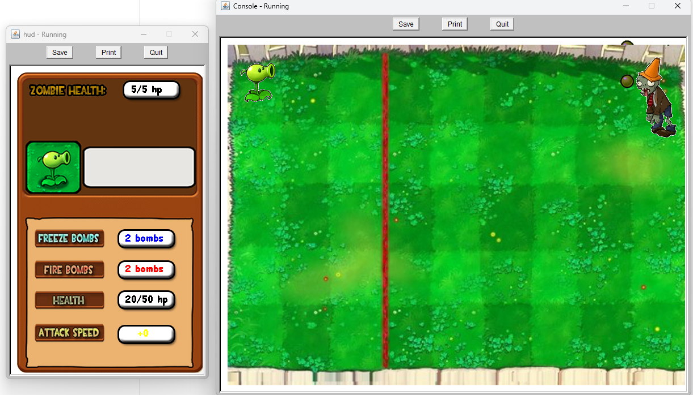

# Java-RGP-PVZ

This is my first RPG game I made back in Highschool. It demonstrates fundenmental programming and even animations with pictures.

# Installation

1. Install Dr Java https://drjava.sourceforge.net/  
2. Go to `edit` -> `Preferencse`
3. Add[ `hsa.jar`](/Game/hsa.jar) to Resource Location

# Playing Game

Run the `RPGgame.java`

# Screenshots

